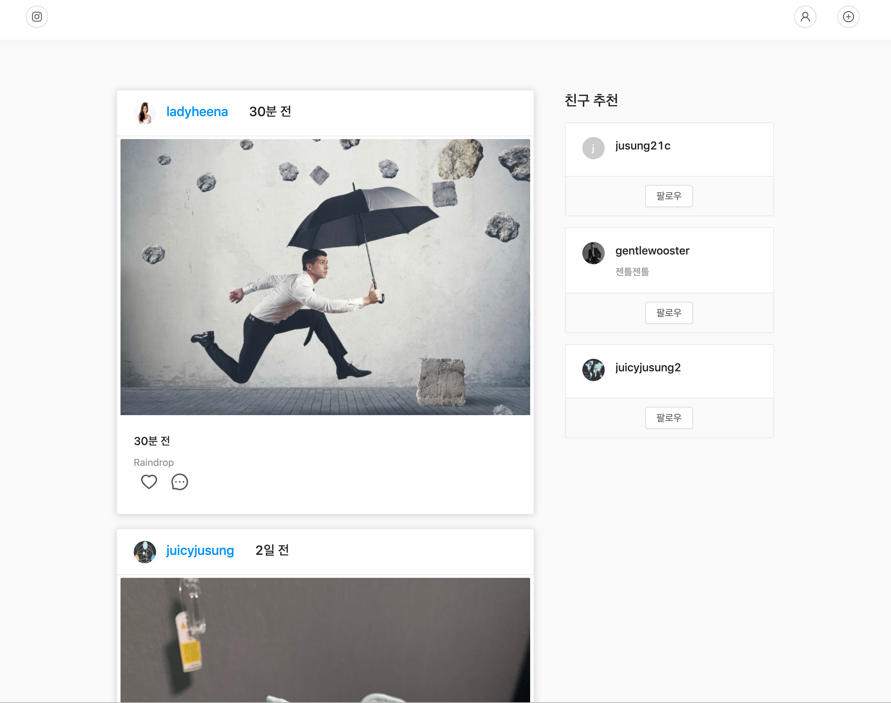
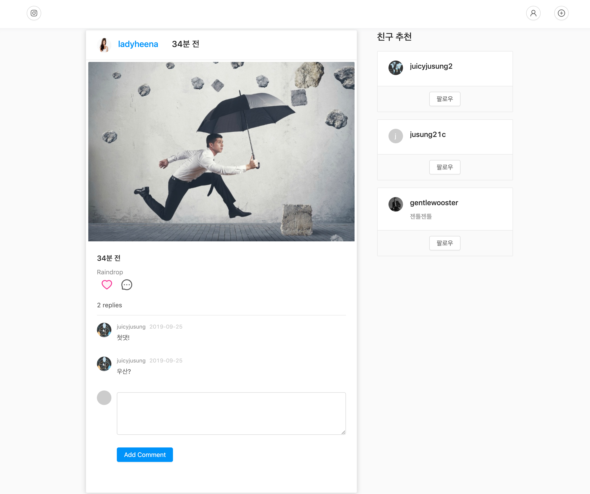

# juicygram

## 소개

sns 서비스

[Demo](http://34.97.37.213:3000/)
geust/guest

### 기술 스택

- Express.js
- React.js
    - Redux
    - Saga
- Ant Design
- MySQL
    - Sequelize
- AWS
    - ec2
    - S3

## 스크린샷

## 프로젝트 실행

juicygram 프로젝트는 백엔드와 프론트엔드 Repository가 분리되어있습니다.

- [juicygram-backend 바로가기](https://github.com/juicyjusung/juicygram-backend)
- [juicygram-frontend 바로가기](https://github.com/juicyjusung/juicygram-front)

### Back-end

**Download the repo:**

    git clone https://github.com/juicyjusung/juicygram-backend
    cd juicygram-backend

**Write .env**

root 디렉토리에 **.env** 파일을 생성하고 환경에 맞게 작성한다.

    DB_PASSWORD=
    DB_USERNAME=
    DB_HOST=
    DB_DATABASE=
    COOKIE_SECRET=
    CORS_ORIGIN=
    S3_ACCESS_KEY_ID=
    S3_SECRET_ACCESS_KEY=

**Install it and run:**

    npm i
    npm run dev

### Front-end

**Download the repo:**

    git clone https://github.com/juicyjusung/juicygram-frontend
    cd juicygram-backend

**Write .env**

root 디렉토리에 **.env** 파일을 생성하고 환경에 맞게 작성한다.

    PROD_API_URL=
    DEV_API_URL=

**Install it and run:**

    npm i
    npm run dev
